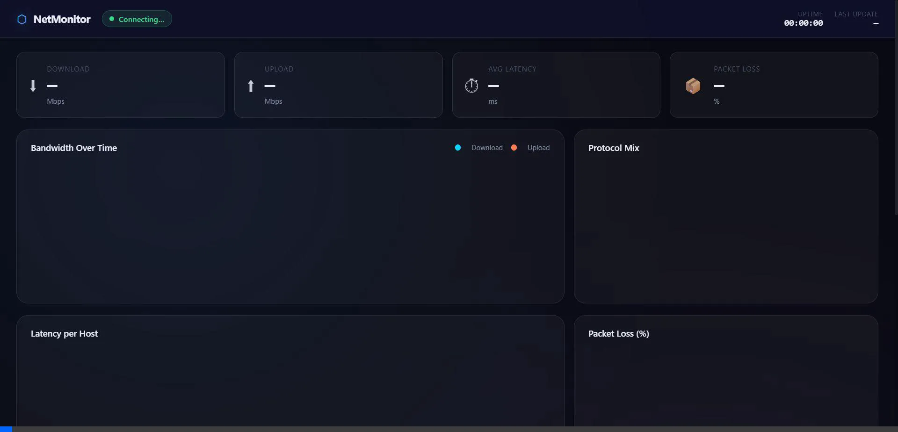

<div id="top" align="center">

# Network Monitoring & Performance Analysis
*Real-time network monitoring, performance analysis, and bottleneck detection.*


*Built with the tools and technologies:*


</div>

---

## Table of Contents

- [Overview](#overview)
- [Web App Preview](#web-app-preview)
- [Features](#features)
- [Project Structure](#project-structure)
- [Getting Started](#getting-started)
  - [Prerequisites](#prerequisites)
  - [Installation](#installation)
  - [Usage](#usage)
- [Configuration](#configuration)
- [Output Files](#output-files)
- [Alerts](#alerts)
- [Troubleshooting](#troubleshooting)
- [Contributing](#contributing)
- [License](#license)

---

## Overview

Network Monitoring & Performance Analysis is a modular, beginner-friendly Python tool for real-time network diagnostics. It monitors bandwidth usage, measures latency and packet loss, captures live packets, detects bottlenecks, logs data to CSV, and generates visual performance reports — all through a clean, live CLI dashboard.

---

## Web App Preview



---

## Features

- 📡 **Bandwidth Monitoring** — Tracks real-time upload and download speeds using `psutil`
- 📶 **Ping Monitoring** — Measures latency and packet loss to multiple targets
- 🔍 **Packet Sniffing** — Captures live network packets using Scapy
- 🚨 **Bottleneck Detection** — Automatically detects anomalies and triggers threshold-based alerts
- 📝 **Data Logging** — Logs all measurements to a thread-safe CSV file
- 📊 **Visualization** — Generates performance graphs using Matplotlib
- 🖥️ **Live Dashboard** — Displays a real-time CLI dashboard powered by `rich`
- 🧩 **Modular Design** — Each component is independent and easy to extend or replace

---

## Project Structure

```
Network-Monitoring---Performance-Analysis/
├── config.py               # Edit thresholds & settings here
├── bandwidth_monitor.py    # Upload/Download speed (psutil)
├── ping_monitor.py         # Latency & packet loss (subprocess ping)
├── packet_sniffer.py       # Packet capture (Scapy)
├── bottleneck_detector.py  # Anomaly detection & alerts
├── logger.py               # Thread-safe CSV logging
├── visualizer.py           # Matplotlib graphs
├── dashboard.py            # Live CLI dashboard (rich)
├── server.py               # Web server
├── main.py                 # Entry point
├── requirements.txt
└── README.md
```

---

## Getting Started

### Prerequisites

- Python 3.10+
- **Windows only:** [Npcap](https://npcap.com/#download) — required for Scapy packet capture
  - During install, check **"Install Npcap in WinPcap API-compatible mode"**

### Installation

1. **Clone the repository:**

```sh
git clone https://github.com/Waroo04/Network-Monitoring---Performance-Analysis
cd Network-Monitoring---Performance-Analysis
```

2. **Create a virtual environment (recommended):**

```sh
python -m venv venv

# Windows:
venv\Scripts\activate

# Linux/macOS:
source venv/bin/activate
```

3. **Install dependencies:**

```sh
pip install -r requirements.txt
```

### Usage

> **Important:** Packet capture (Scapy) requires **Administrator** privileges on Windows or **sudo** on Linux/macOS.

**Run indefinitely** (Ctrl+C to stop):

```sh
# Windows – run as Administrator:
python main.py

# Linux/macOS:
sudo python main.py
```

**Run for a fixed duration:**

```sh
python main.py --duration 120
```

**Disable packet sniffer** (no admin needed):

```sh
python main.py --no-sniff
python main.py --no-sniff --duration 60
```

**Disable the CLI dashboard:**

```sh
python main.py --no-dashboard
```

**Generate a performance graph from existing CSV:**

```sh
python main.py --report
```

---

## Configuration

Edit **`config.py`** to customise thresholds and settings:

| Setting | Default | Description |
|---------|---------|-------------|
| `PING_TARGETS` | 8.8.8.8, 1.1.1.1, google.com | Hosts to ping |
| `BANDWIDTH_INTERVAL` | 1 s | How often bandwidth is sampled |
| `PING_INTERVAL` | 5 s | How often ping tests run |
| `MIN_DOWNLOAD_MBPS` | 1.0 | Alert threshold – download speed |
| `MIN_UPLOAD_MBPS` | 0.5 | Alert threshold – upload speed |
| `MAX_LATENCY_MS` | 150 | Alert threshold – ping latency |
| `MAX_PACKET_LOSS_PCT` | 10 | Alert threshold – packet loss |

---

## Output Files

| File | Description |
|------|-------------|
| `network_log.csv` | All measurements: timestamp, speeds, latency, alerts |
| `network_report.png` | Performance graph (generated with `--report`) |

**Viewing the CSV:**

```sh
# Windows PowerShell
Get-Content network_log.csv | Select-Object -First 10

# Linux/macOS
head network_log.csv
```

---

## Alerts

The tool automatically triggers alerts when:

- Download speed drops below `MIN_DOWNLOAD_MBPS`
- Upload speed drops below `MIN_UPLOAD_MBPS`
- Ping latency exceeds `MAX_LATENCY_MS`
- Packet loss exceeds `MAX_PACKET_LOSS_PCT`
- A host is completely unreachable

---

## Troubleshooting

| Problem | Solution |
|---------|----------|
| `PermissionError` from Scapy | Run as Administrator / sudo |
| `ModuleNotFoundError: scapy` | `pip install scapy` + install Npcap (Windows) |
| Dashboard looks garbled | Use Windows Terminal or a modern terminal emulator |
| No packets captured | Verify Npcap is installed; try `--no-sniff` |
| CSV is empty | Increase `--duration` or check firewall isn't blocking ping |

---

## Contributing

Contributions are welcome! You can help by:

- Reporting bugs or issues
- Suggesting new features or improvements
- Forking the project and submitting pull requests

---

## License

This project is licensed under the **MIT License** — see the [LICENSE](LICENSE) file for details.

---

<div align="left"><a href="#top">⬆ Return to top</a></div>
